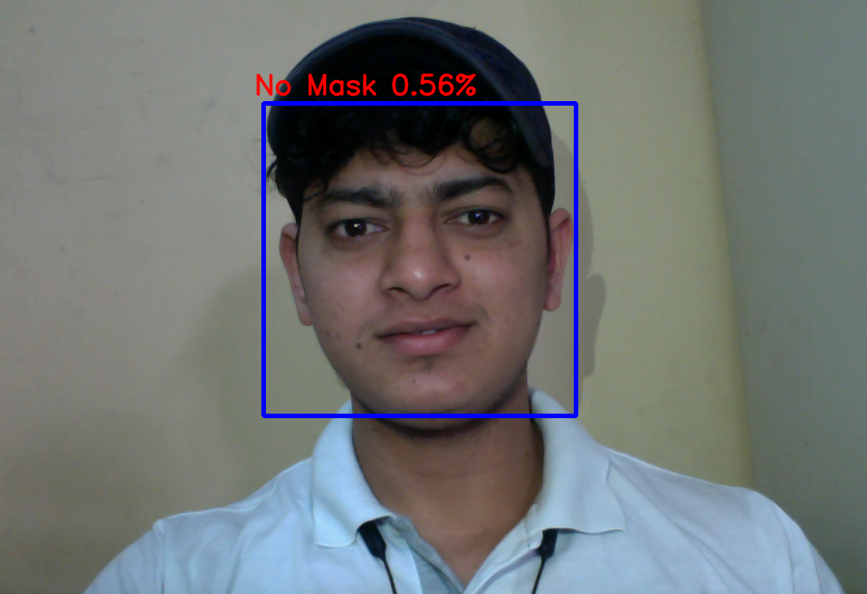
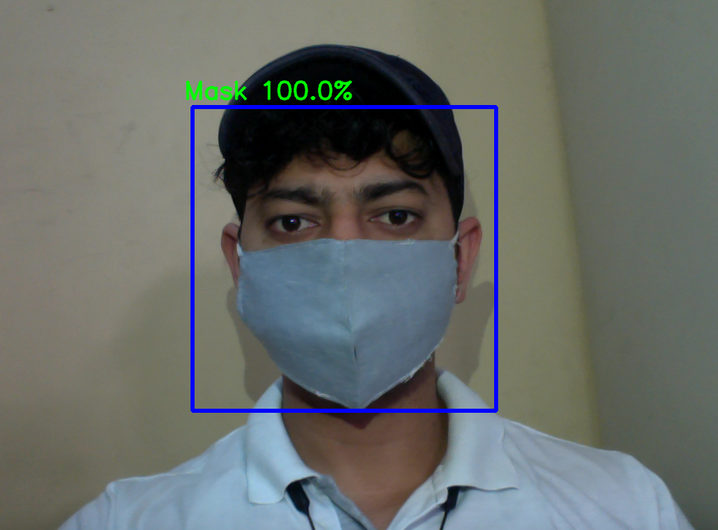

# Face_mask_detection
This project is a part of the CNN Deep learning and Opencv.

#### -- Project Status: [Completed]

Screenshots:

 
----------
## Project Intro/Objective
The purpose of this project is to detect whether person has wear mask or not.

### Methods Used
* Data gathering
* Data preprocessing
* Build CNN model
* Model evaluation
* Predictive Modeling

### Technologies
* Python
* jupyter
* Numpy 
* Matplotlib
* tensorflow>=2.1.0
* keras==2.3.1
* Opencv

## Project Description
This is project based on CNN model. 
Dataset used by this project is 'https://drive.google.com/drive/folders/1P3gIgFUMbdl5tSqx1pK385bz4t0mxEvW?usp=sharing'. Dataset conatins train, test and validation data in each there are two class 'with_mask' and 'without_mask'. After downloading and importing dataset(in Google colab) i did data image augmentation first like rescale image, rotate image, flip image, zoom image etc.
#### **Data Augmentation**: It is a way to generate more training data frm our currenet set. It augments the training data by generating new eg via random transformation of existing ones. This way we artificially boost the size of the training set, reducing overfitting.
After that i just use 'model checkpoint' callback function to save best model as 'Face_mask_scratch.h5'.

After that i just create CNN model as follow

(Face_mask_detection using transferlearning 'https://github.com/vishalbarad/Face_mask_detection_transferlearning')

After that i just compile model using 'Adam' optimizer with learning rate=0.01, loss='sparse_categorical_crossentropy'.

After that i just fit data using 50 epochs.

At the end i got 98% validation accuracy and 96% training accuracy.

Then again i just saved model as 'final_Face_mask_scratch.h5'.

After downloading model i made 'prediction.ipynb' file using Opencv to predict output.

## Needs of this project

- frontend developers
- data exploration/descriptive statistics
- data processing/cleaning
- writeup/reporting

## Contact
* Feel free to contact me any questions or if you are interested in contributing!

<h1 align=center>Thank You</h1>

